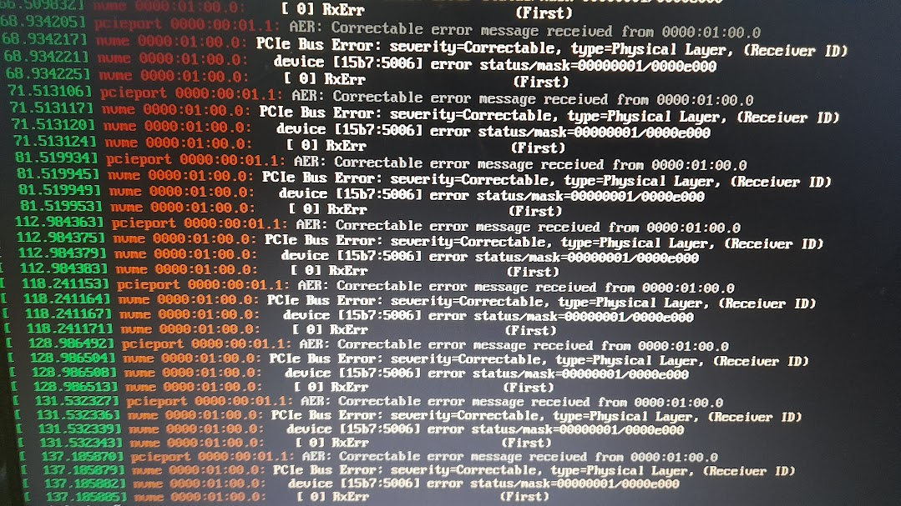

# "PCIe Bus Error" on certain Samsung and Western Digital NVMe SSDs

Found this problem when trying to install Proxmox 8.2 in a Western Digital SN730 1TB. Was also able to replicate it in Arch Linux.

I'm not sure if this is related to the Drive or the Motherboard (Lenovo B450M 3141), but Disabling PCIe Active State Power Management/ASPM fixes it. The parameter is `pcie_aspm=off`. You can set this parameter by changing `/etc/kernel/cmdline` and then running `proxmox-boot-tool refresh`.

